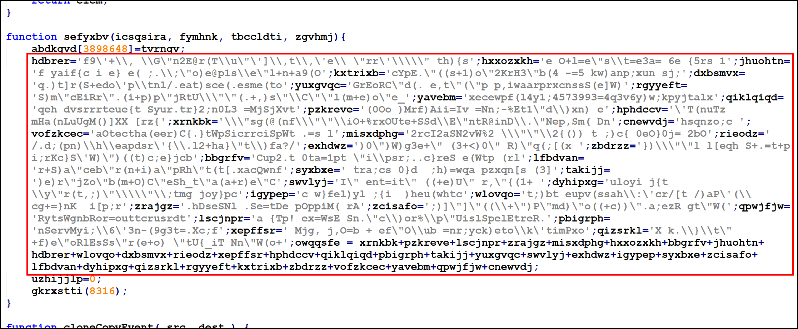
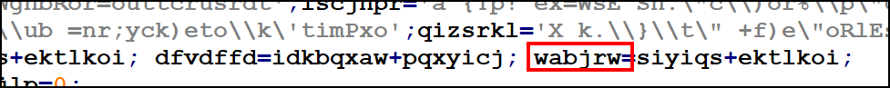
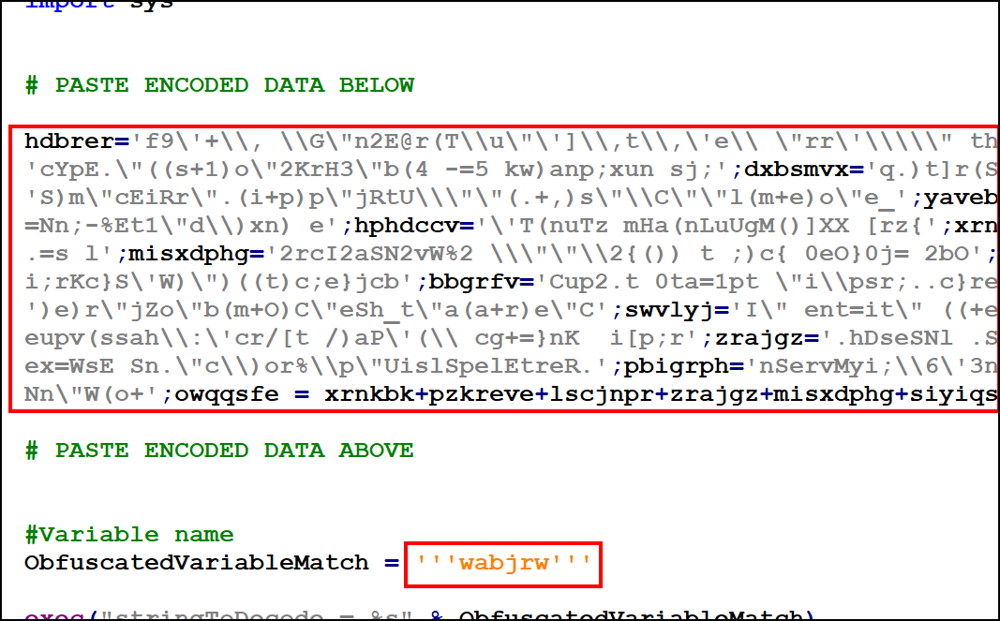
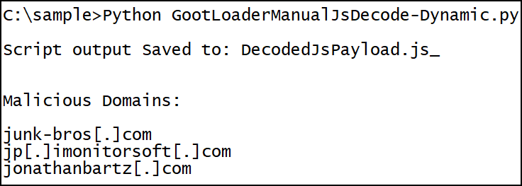

# Gootloader Manual Decoding

This guide provides instructions on how to decode a GOOTLOADER `js` file when the automated script fails. These instructions only work on pre-GOOTLOADER Obfuscation Variant 3.0 samples. 

**Warning: The following script executes part of the GOOTLADER code, as a result it should only be run in an isolated environment. This script should only be used if the static version (GootLoaderAutoJsDecode.py) fails.**

## Background

GOOTLOADER works by setting various variables with obfuscated text. These variables are concatenated and run through two decoding functions. The automated script can usually find the variables and decode them on its own. However, sometimes the GOOTLOADER obfuscation changes and the script code needs to be modified. This guide shows you how to manually find the variables while still allowing you to leverage most of the script's automation.  

# How to Decode

1. Download [GootLoaderManualJsDecode-Dynamic.py](GootLoaderManualJsDecode-Dynamic.py) and the GOOTLOADER `js` file to your VM.

2. Find the relevant payload section by searching with the regex below.

    ```
    .*\+.*\+.*\+.*\+.*\+.*\+.*\+.*\+.*(\n.*\=.*\+.*)*
    ```

    The text should resemble the screenshot below.

    

3. Paste the text into the `PASTE ENCODED DATA BELOW`/`PASTE ENCODED DATA ABOVE` section of the [GootLoaderManualJsDecode-Dynamic.py](GootLoaderManualJsDecode-Dynamic.py) script.

4. Find the name of the last variable that gets set, and paste the text into the `PASTE THE VARIABLE NAME HERE` section of the [GootLoaderManualJsDecode-Dynamic.py](GootLoaderManualJsDecode-Dynamic.py) script.

    ```
    dfvfd = siyiqs+ektlkoi; dfvdffd=idkbqxaw+pqxyicj; wabjrw = siyiqs+ektlkoi
    ```
    In this instance we want the variable "wabjrw" since it is the last one that is set.

    

5. At this point the script should look like the screenshot below.

    

6. Run the script and it should return the decoded payload.

    ```bash
    python GootLoaderManualJsDecode-Dynamic.py
    ```

    
