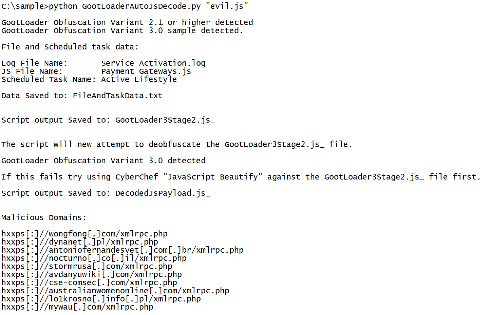
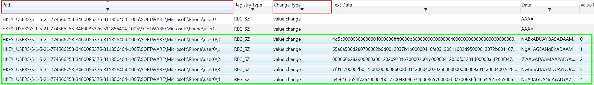
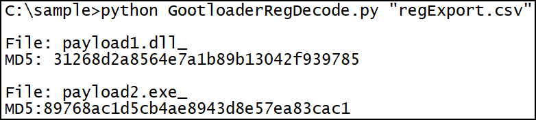

# Script Overview

- `GootLoaderAutoJsDecode.py` - automatically decodes `.js` files using static analysis (recommended)
- `GootLoaderAutoJsDecode-Dynamic.py` - automatically decodes `.js` files using dynamic analysis
- `GootLoaderManualJsDecode-Dynamic.py` - used to manually decode `.js` files using dynamic analysis
- `GootloaderRegDecode.py` - automatically decodes reg payload exports
- `GootloaderWindowsRegDecode.ps1` - Directly decodes a payload from the registry. 

# Index

- [Javacript Decoding:](#javacript-decoding)
  * [Automated Decoding](#automated-decoding)
  * [Manual Decoding](#manual-decoding)
  * [Sample MD5](#sample-js-md5)
- [Registry Payload Instructions:](#registry-payload-decoding)
  * [Redline](#redline)
  * [Decoding the CSV File](#decoding-the-csv-file)


# Javacript Decoding


## Automated Decoding
Run the script `GootLoaderAutoJsDecode.py` against the `.js` file.

```bash
python GootLoaderAutoJsDecode.py "evil.js"
```

The script will output the file `DecodedJsPayload.js_`. You can use a CyberChef's `Generic Code Beautify` in order to make the content easier to read.



If the `GootLoaderAutoJsDecode.py` script stops working then you can attempt to use the dynamic version of the script (`GootLoaderAutoJsDecode-Dynamic.py`). Be aware that the dynamic script executes part of the GOOTLADER code, as a result it should only be run in an isolated environment.

## Manual Decoding
Sometimes the GOOTLOADER `js` obfuscation changes and the `GootLoaderAutoJsDecode.py` script stops working. In those instances, follow the instructions found at [ManualDecoding.md](ManualDecoding.md).

## Sample MD5s:

```
Gootloader Obfuscation Variant 2:
82607b68e061abb1d94f33a2e06b0d20
961cd55b17485bfc8b17881d4a643ad8
af9b021a1e339841cfdf65596408862d
d3787939a5681cb6d6ac7c42cd9250b5

Gootloader Obfuscation Variant 3:
ea2271179e75b652cafd8648b698c6f9
c07b581fde56071e05754eef450dfa17
```

# Registry Payload Decoding

## Redline

1. On the left menu go to `Agent Events\Registry Key Events`
2. Filter on the following:
   * Change Type: `value change`
   * Path: `HKEY_USERS\<USER_SID>\SOFTWARE\Microsoft\Phone\%USERNAME%`
      * The specific path might change, but you should end up with two sets of keys, one called `...\Phone\UserName\...` and one called `...\Phone\UserName0\...`.
3. Select all the rows that have something in the `Text Data` field. 
4. Right click and select "Copy with Headers"
5. Paste the text into a text document and save it as a CSV



## Decoding the CSV File

1. Transfer the CSV and Python scripts to the same machine
2. Run the command below:

```bash
python GootloaderRegDecode.py "regExport.csv"
```
3. The script should generate 2 files `payload1.dll_` and `payload2.exe_`



